# UTS-Pengenalan-Big-Data
1.	Cari dan sebutkan 3 DBMS yang bisa digunakan untuk mengelola big data
-	MySQL   
-	ORACLE
-	MICROSOFT SQL SERVER
2.	Carilah contoh masalah big data yang bisa dikelola menggunakan salah satu DBMS tersebut, jelaskan mulai dari instalasi sampai CRUD untuk data menggunakan DBMS tersebut. Asumsikan anda akan memecahkan masalah big data yang sudah anda cari contoh tadi, jelaskan kira-kira bagaimana arsitektur dari solusi big data menggunakan DBMS tersebut, gambarkan diagramnya.
a.	Menggunakan DBMS Mysql
Membuat big data “Data Barang pada sebuah Minimarket”, dalam pengelolaannya maka harus bisa untuk membuat data baru, membaca data yang telah dibuat, mengedit data yang telah dibuat, dan menghapus data yang telah dibuat (menghapus data tersebut karena stock barang telah habis).
-Pertama, menginstall XAMPP.  Apabila XAMPP sudah terdownload maka hidupkan “APACHE” dan “MYSQL”.
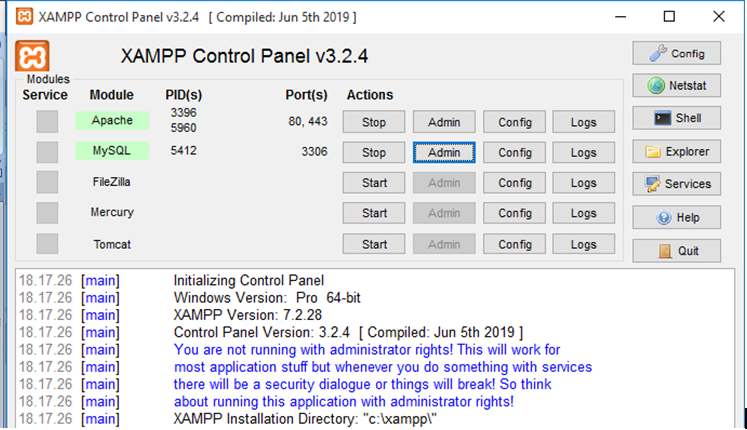 
-Kedua, membuka browser dan mengetik localhost/phpmyadmin. Maka tampilannya seperti dibawah ini :
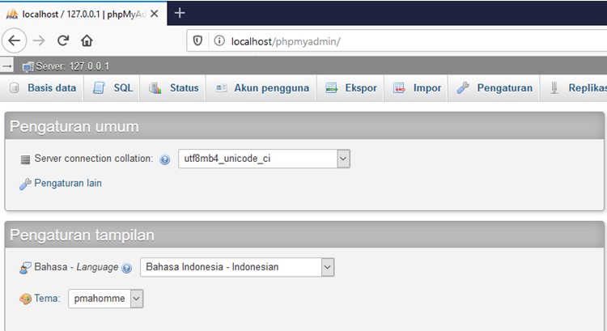 
-Ketiga, membuat database. Klik Basis data, maka tampilannya seperti dibawah ini :
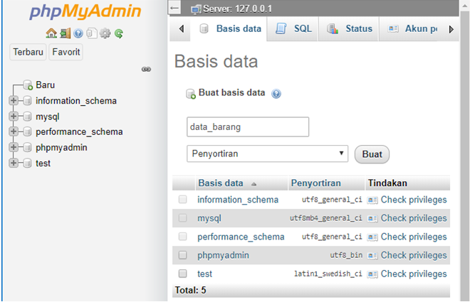 
-Keempat, membuat apa saja yang diperlukan dalam kolom untuk data barang tersebut.
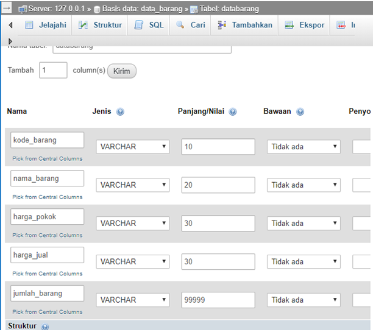 
-Kelima, setelah itu klik simpan/kirim untuk membuat tampilan pada kolom
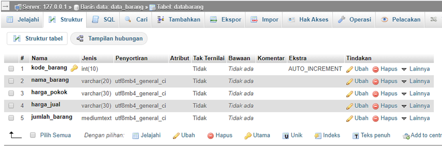 
-Keenam,  membuat nilai pada kolom
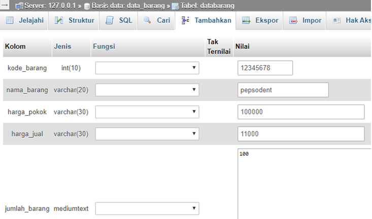 
Klik simpan/kirim, maka tampilannya seperti dibawah ini
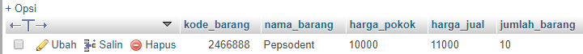 
Membuat koneksi.php agar dapat terhubung denga database
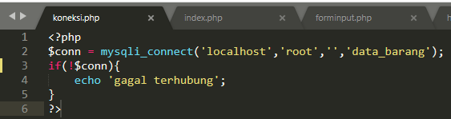 
Apabila koneksi berhasil terhubung maka tampilannya kosong
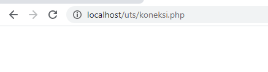 
-Ketujuh, membuat index.php
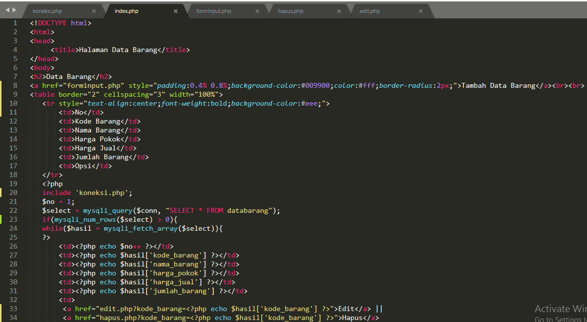 
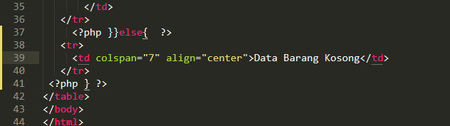 
Maka tampilannya pada browser seperti dibawah ini 
Localhost/uts/index.php
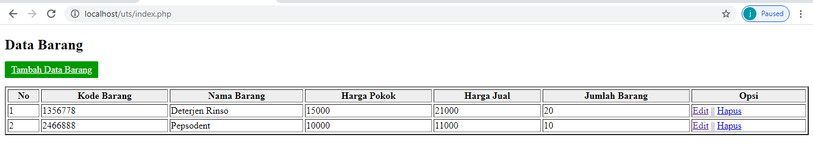 
-Kedelapan, membuat forminput.php
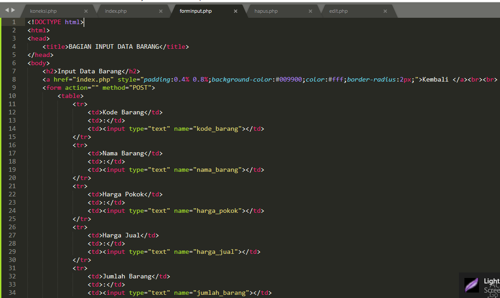 
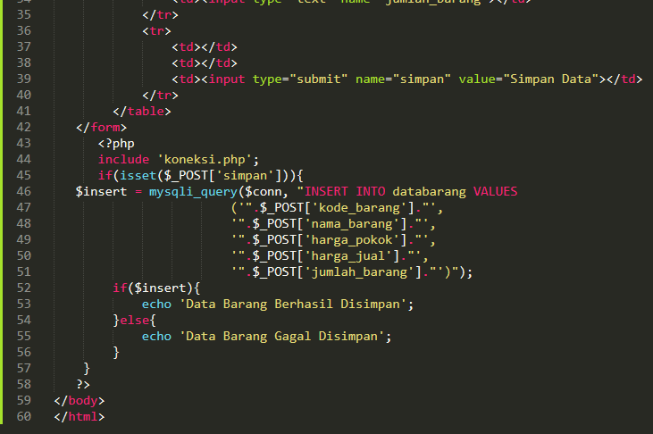 
Maka tampilannya seperti dibawah ini :
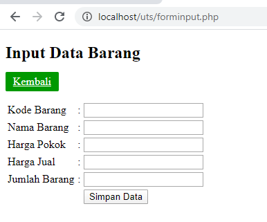 
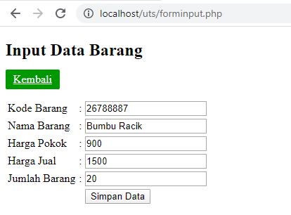 
Data barang berhasil disimpan
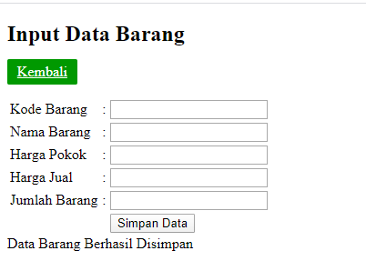 
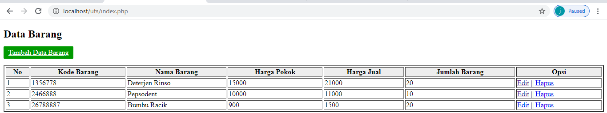 
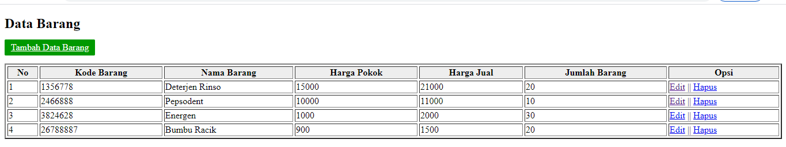 
-Kesembilan, membuat form edit.php
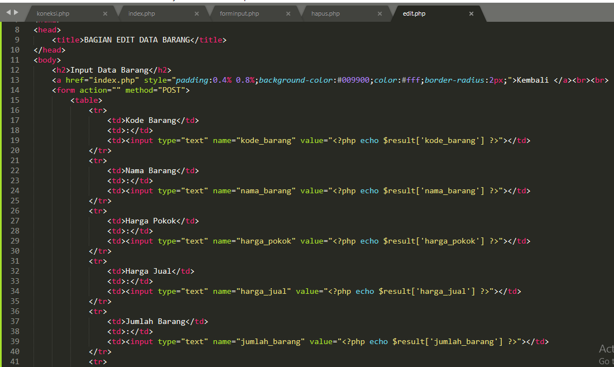 
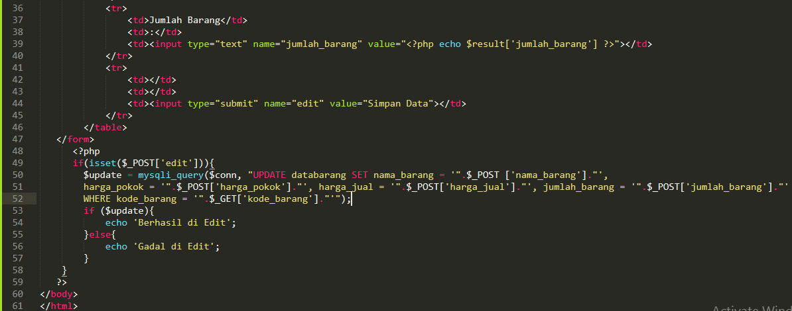 
Apabila diteka edit, maka tampilannya seperti dibawah ini :
Maka tampilannya seperti dibawah ini :
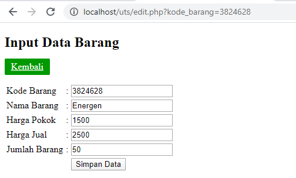 
Berhasil di edit
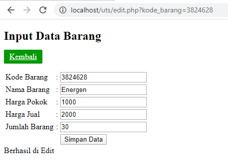 
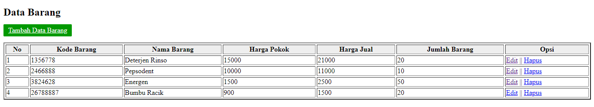 
-Kesepuluh, membuat form hapus.php
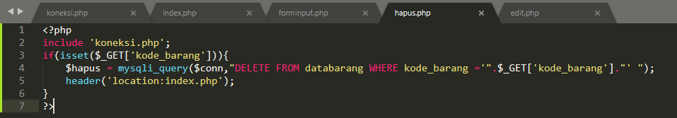 
setelah ditekan hapus maka tampilannya seperti dibawah ini :
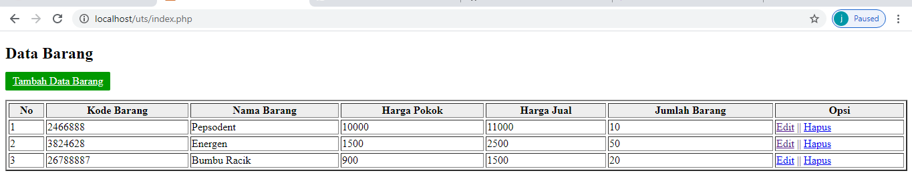 
Tampilan pada PHPMYADMIN
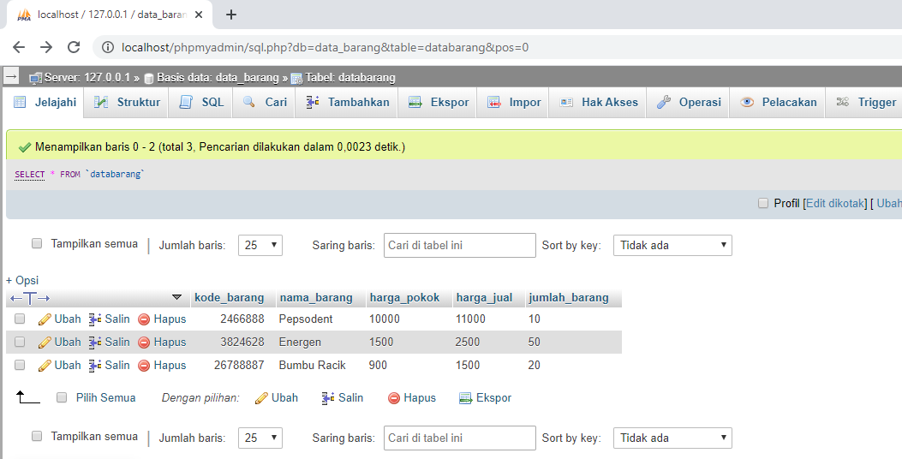 

GAMBARAN ARSITEKTUR
 
